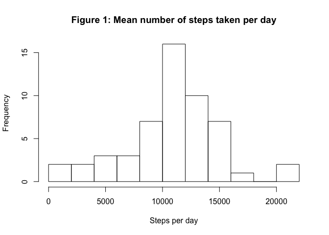
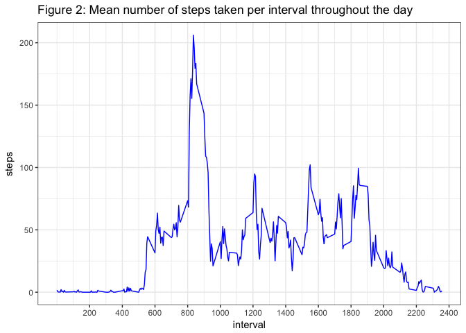
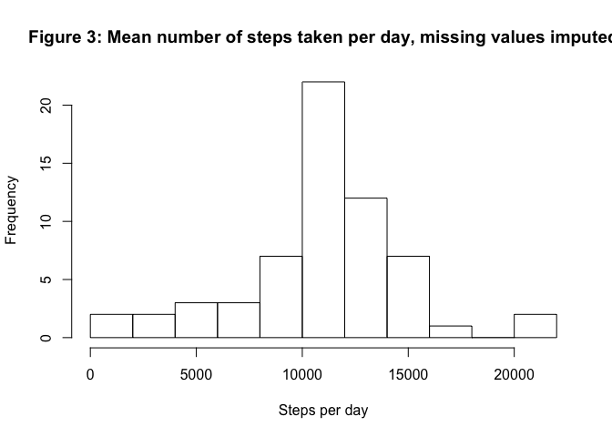
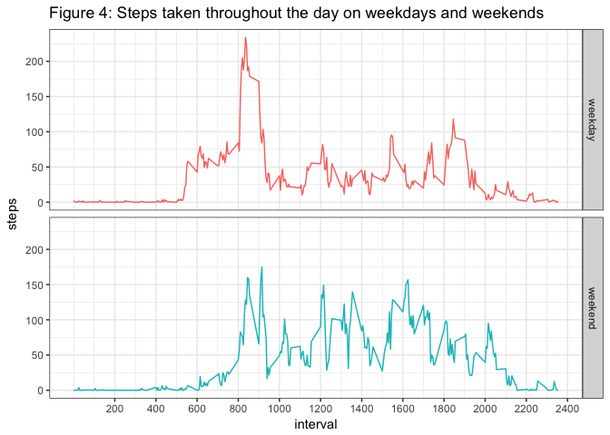
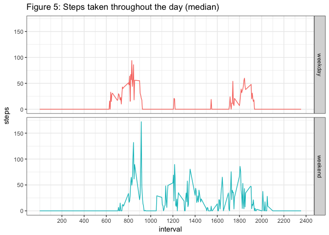

# Analysis of daily activity patterns


### Introduction

It is now possible to collect a large amount of data about personal movement using activity monitoring devices. This study analyses data collected from such a device worn by an anonymous individual during the months of October and November 2012. The dataset consists of the number of steps taken in 5 min intervals each day.

This study will answer the following questions:

1. What is the mean total number of steps taken each day?

2. What is the average daily activity pattern?

3. In which way does imputing missing values change the analysis of the dataset?

4. Are there differences in activity patterns between weekdays and weekends?
<br><br>

### Method

The analysis was conducted in R and code used is available throughout the report. Relevant libraries and data were loaded as detailed below, and the data was read into R.


```r
library(downloader)
library(lubridate)
```

```
## 
## Attaching package: 'lubridate'
```

```
## The following object is masked from 'package:base':
## 
##     date
```

```r
library(dplyr)
```

```
## 
## Attaching package: 'dplyr'
```

```
## The following objects are masked from 'package:lubridate':
## 
##     intersect, setdiff, union
```

```
## The following objects are masked from 'package:stats':
## 
##     filter, lag
```

```
## The following objects are masked from 'package:base':
## 
##     intersect, setdiff, setequal, union
```

```r
library(ggplot2)

url <- "https://d396qusza40orc.cloudfront.net/repdata%2Fdata%2Factivity.zip"
download(url, dest="activity.zip", mode="wb") 
unzip ("activity.zip")
amd <- read.csv("activity.csv")
```
The data structure was assessed with the str command and data was preprocessed as follows: The "date" column was converted into date format and an additional column was added to differentiate between weekdays and weekend days.


```r
str(amd)
```

```
## 'data.frame':	17568 obs. of  3 variables:
##  $ steps   : int  NA NA NA NA NA NA NA NA NA NA ...
##  $ date    : Factor w/ 61 levels "2012-10-01","2012-10-02",..: 1 1 1 1 1 1 1 1 1 1 ...
##  $ interval: int  0 5 10 15 20 25 30 35 40 45 ...
```

```r
amd$date <- ymd(amd$date)
amd$day <- ifelse(weekdays(amd$date) == "Saturday" | weekdays(amd$date) == "Sunday","weekend","weekday")
```
<br>

### Results
<br>

#### Question 1: What is the mean total number of steps taken per day?

Figure 1 shows a histogram of the mean number of steps taken each day.


```r
amd2 <- aggregate(steps~date, data=amd, FUN=sum, na.rm=TRUE)
hist(amd2$steps, breaks=8, main=paste("Figure 1: Mean number of steps taken per day"), xlab="Steps per day")
```

<!-- -->

```r
mean(amd2$steps)
```

```
## [1] 10766.19
```

```r
median(amd2$steps)
```

```
## [1] 10765
```

```r
mean_steps <- as.character(round(mean(amd2$steps), digits=0))
```

The data seems to be more or less normally distributed, ranging from less than 100 to more than 20,000 steps per day, with very similar values for mean and median -- a mean of 10766 and a median of 10765 steps per day.
<br><br>

#### Question 2: What is the average daily activity pattern?

The mean number of steps taken per interval throughout the day is displayed in figure 2.


```r
amd3 <- aggregate(steps~interval, data=amd, FUN=mean, na.rm=TRUE)
ggplot(amd3, aes(interval, steps, group=1)) + geom_line(colour="blue") +   labs(title="Figure 2: Mean number of steps taken per interval throughout the day") + theme_bw() + scale_x_continuous(breaks=c(200, 400, 600, 800, 1000, 1200, 1400, 1600, 1800, 2000, 2200, 2400))
```

<!-- -->

```r
max <- amd3[which.max(amd3$steps),]
max
```

```
##     interval    steps
## 104      835 206.1698
```

Activity starts at 5.30 am in the morning, exhibiting a sharp 20 minute peak between 8 and 9.30 am. Moderate activity continues throughout the day, trails off from around 7 pm and ceases around midnight. The maximum number of ` steps is taken in the 5 min interval starting at The 5 minute interval of peak activity is starting at 8.35 am, and contains 206 steps.
<br><br>

#### Question 3: In which way does imputing missing values change the analysis of the dataset?

To be able to imput missing values, it is important to understand where in the dataset the missing values occur and whether they are randomly distributed or clustered.


```r
amd_na <- amd[rowSums(is.na(amd)) > 0,]
nrow(amd_na)
```

```
## [1] 2304
```

```r
length(unique(amd_na$date))
```

```
## [1] 8
```

```r
unique(amd_na$date)
```

```
## [1] "2012-10-01" "2012-10-08" "2012-11-01" "2012-11-04" "2012-11-09"
## [6] "2012-11-10" "2012-11-14" "2012-11-30"
```

```r
aggregate(date~day, data=amd_na, FUN=unique)
```

```
##       day                                     date
## 1 weekday 15614, 15621, 15645, 15653, 15658, 15674
## 2 weekend                             15648, 15654
```

The quick check above reveals that there are 2304 rows with missing values in the dataset and they are spread over eight different days. Since eight days correspond to 8 x 24 x 12 = 2304 intervals, we can conclude that all data is missing from these eight days. Of the eight days, six are weekdays and two are weekend days.

Since weekdays are likely to have different activity patterns than weekend days, it was decided to impute the missing values by replacing missing weekday data with the mean number of steps per interval on weekdays and missing weekend data with the mean number of steps per interval on weekends.

To this end, the mean steps per interval were computed for weekdays and weekends.


```r
amd_wd <- filter(amd, day=="weekday")
amd_wd_mean <- aggregate(steps~interval, data=amd_wd, FUN=mean, na.rm=TRUE)
amd_we <- filter(amd, day=="weekend")
amd_we_mean <- aggregate(steps~interval, data=amd_we, FUN=mean, na.rm=TRUE)
```

The missing data was split into weekdays and weekends.


```r
amd_na_wd <- filter(amd_na, day=="weekday")
amd_na_we <- filter(amd_na, day=="weekend")
```
    
Care was taken to ensure that all datasets were in the right order before any data was replaced.


```r
amd_wd_mean <- arrange(amd_wd_mean, interval)
amd_we_mean <- arrange(amd_we_mean, interval)
amd_na_wd <- arrange(amd_na_wd, date, interval)
amd_na_we <- arrange(amd_na_we, date, interval)
```
    
And missing values were replaced with the appropriate averaged steps per interval dataset.


```r
amd_na_wd$steps <- amd_wd_mean$steps
amd_na_we$steps <- amd_we_mean$steps
```

Finally, the complete dataset with missing values imputed was reconstructed.


```r
amd_no_na <- amd[rowSums(is.na(amd)) == 0,]
amd_na_imputed <- rbind(amd_no_na, amd_na_wd, amd_na_we)
```

And the analysis carried out for question 1 was repeated. Figure 3 shows a histogram of the mean number of steps taken each day, now with missing data imputed.


```r
amd_na_imputed2 <- aggregate(steps~date, data=amd_na_imputed, FUN=sum, na.rm=TRUE)
hist(amd_na_imputed2$steps, breaks=8, main=paste("Figure 3: Mean number of steps taken per day, missing values imputed"), xlab="Steps per day")
```

<!-- -->

```r
mean(amd_na_imputed2$steps)
```

```
## [1] 10762.05
```

```r
median(amd_na_imputed2$steps)
```

```
## [1] 10571
```

The mean changes very little after the imputed data has been added to the dataset - from 10766 to 1.0762052\times 10^{4} steps per day. This was to be expected as missing values have been imputed based on the mean. The median changes slightly, from 10765 to 1.0571\times 10^{4} steps per day, due to more values being added in the middle ranks.
<br><br>

#### Question 4: Are there differences in activity patterns between weekdays and weekends?

Since it is very likely that the activity patterns are different on weekdays and weekends, it makes sense to split the above data along the weekday/weekend factor added during data preprocessing. Figure 4 displys both graphs side by side.


```r
amd_na_imputed3 <- aggregate(steps~interval+day, data=amd_na_imputed, FUN=mean)
ggplot(amd_na_imputed3, aes(interval, steps, colour=day)) + facet_grid(day~.) + 
geom_line() + theme_bw() + theme(legend.position="none") + labs(title="Figure 4: Steps taken throughout the day on weekdays and weekends") + scale_x_continuous(breaks=c(200, 400, 600, 800, 1000, 1200, 1400, 1600, 1800, 2000, 2200, 2400))
```

<!-- -->

And indeed, activity on a weekend starts later than during the week, the peak around 8.30 am disappears, activity throughout the day is more continuous and trails off slightly later.
<br><br>

### Conclusions

So what have we learned by monitoring the daily activity of our anonymous friend. A look at figure 4 suggests a busy life. On weekdays the day starts at 5 am and activity rises sharply between 8 and 9 am. Somebody who likes to rise early and water the plants before rushing off to work? A parent woken up and kept awake by a grumpy toddler? One hour seems a long time to work to work, maybe an older child needs to be dropped at school before? And look at the day - this person seems to be on the move continuously and doesn't even sit down for lunch. The toddler again keeping the parent busy? A policeman or woman? A postman? Between 6 and 7 pm another raise in activity, maybe the morning journey made in reserve. After that a bit of peace at last after that, even though there is still some residual activity until midnight. On weekends the day starts again at 6 am (early bird or the toddler?), followed by substantial activiy during the day that only trails off at 9 pm in the evening. What a busy life!

Or is the mean maybe misleading? Let's have a look at the median activity for each interval. Due to its definition as the middle rank, the median underemphasizes values at both ends of the distribution and is possibly more representative of a typical day in the life of our friend. Figure 5 represents the median number of steps taken in each interval on weekdays and on weekends.


```r
amd_na_imputed4 <- aggregate(steps~interval+day, data=amd_na_imputed, FUN=median)
ggplot(amd_na_imputed4, aes(interval, steps, colour=day)) + facet_grid(day~.) + 
geom_line() + theme_bw() + theme(legend.position="none") + labs(title="Figure 5: Steps taken throughout the day (median)") + scale_x_continuous(breaks=c(200, 400, 600, 800, 1000, 1200, 1400, 1600, 1800, 2000, 2200, 2400))
```

<!-- -->

Oh good, this looks more sustainable. Still an early bird with the alarm apparently going off just after 6 am, 3 hours of activity until our friend settles down for an office job. A quick sandwich at noon and coffee at 3.30 pm, very well organised. Activity again between 5 and 7.30 pm and then a quiet evening and staight to bed. Sleeping in on weekends until 7 am, some activity, a leasurely berakfast between 9.20 and 10.20 am and then off toa free day full of acivities that trils off at 9 pm. That looks like more enjoyable life.

Of course the truth in somewhere inbetween and without knowing more about our friend or having other people to compare to all guesses have to stay just guesses. Who knows, maybe Dr Peng was dedicated enough to generate the data for us himself?


    
