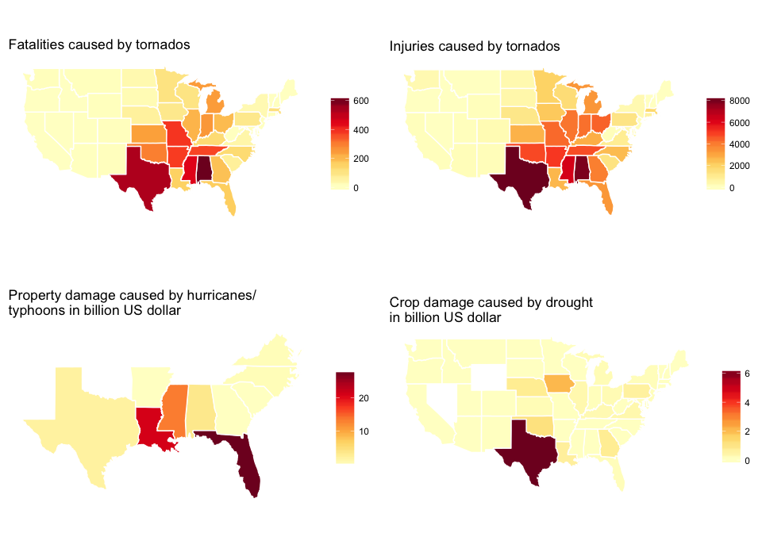
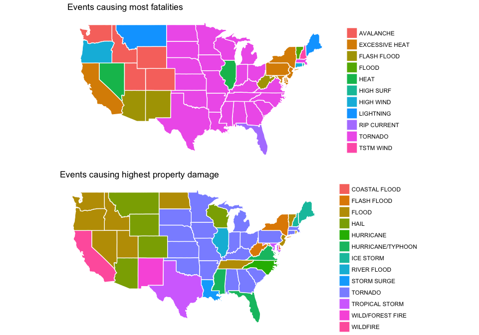

# Damage caused by severe weather events in the US between 1950 and 2011


<br>

### Synopsis

Storms and other severe weather events can cause both public health and economic problems and it is a key concern to minimise these effects. This study aims to identify the severe weather events that have caused most damage to life and property across the US in the past. We use data provided by the U.S. National Oceanic and Atmospheric Administration's (NOAA) storm database which lists severe weather events in the US between 1950 and 2011. Key findings are: Tornados have caused most fatalities and injuries, hurricanes caused the highest property damage and drought the highest damage to crops. The damage caused is localised: Fatalities and injuries due to tornados occured mostly in the South East, damage by floods mostly in California, and damage by drought mostly in texas. On a state level, the most problematic weather events differs, with floods and tornados being the most problematic events across the US. While damage caused by droughts and tornados has been a constant problem over he past 20 years, damage due to floods was mostly due to a single event in 2005/2006. Measures to minimise damage to life and property caused by severe weather events therefore need to be applied on a local level and need to consider whether the event is rare or occurs frequently.

<br>

### Aim of the study

This study will answer the following questions:

1. Across the United States, which types of events are most harmful with respect to population health? Which types of events have the greatest economic consequences?

2. What is the geographical distribution of these events?

3. How has damage evolved over time?

<br>

### Data Processing

The analysis was conducted in R and code used is available throughout the report. Relevant libraries and data were loaded as detailed below, and the data was read into R.


```r
library(downloader)
library(dplyr)
library(lubridate)
library(ggplot2)
library(RColorBrewer)
library(grid)
library(gridExtra)


url <- "https://d396qusza40orc.cloudfront.net/repdata%2Fdata%2FStormData.csv.bz2"
if (!exists("storm")) {download(url, dest="stormdata.csv.bz2", mode="wb")}
storm <- read.csv("stormdata.csv.bz2")
```
<br>

The data structure was assessed with the str command and data was preprocessed as follows: Columns relevant to the research question were selected, values for damage to property and crops were converted into a single format (billion US$). New columns were created for total damage and the sum of fatalities and injuries. Again, irrelevant columns were discarded to obtain a slimmer data frame.

Exploratory data analysis revealed a suspiciously high value for flood property damage in California of 116 billion US$. 115 billion US$ were attributed to a single event on 1 January 2006. This is comparable of the total economic costs attributed to Hurricane Katrina (1), however, the flood does not get a prominent mentioning online (2). Crossreferencing with the latest version of the NOAA database (3) reveal that the value for this particular event has been corrected to 115 million US$. The correction was therefore also carried out in this dataset.


```r
str(storm)
```

```
## 'data.frame':	902297 obs. of  37 variables:
##  $ STATE__   : num  1 1 1 1 1 1 1 1 1 1 ...
##  $ BGN_DATE  : Factor w/ 16335 levels "1/1/1966 0:00:00",..: 6523 6523 4242 11116 2224 2224 2260 383 3980 3980 ...
##  $ BGN_TIME  : Factor w/ 3608 levels "00:00:00 AM",..: 272 287 2705 1683 2584 3186 242 1683 3186 3186 ...
##  $ TIME_ZONE : Factor w/ 22 levels "ADT","AKS","AST",..: 7 7 7 7 7 7 7 7 7 7 ...
##  $ COUNTY    : num  97 3 57 89 43 77 9 123 125 57 ...
##  $ COUNTYNAME: Factor w/ 29601 levels "","5NM E OF MACKINAC BRIDGE TO PRESQUE ISLE LT MI",..: 13513 1873 4598 10592 4372 10094 1973 23873 24418 4598 ...
##  $ STATE     : Factor w/ 72 levels "AK","AL","AM",..: 2 2 2 2 2 2 2 2 2 2 ...
##  $ EVTYPE    : Factor w/ 985 levels "   HIGH SURF ADVISORY",..: 834 834 834 834 834 834 834 834 834 834 ...
##  $ BGN_RANGE : num  0 0 0 0 0 0 0 0 0 0 ...
##  $ BGN_AZI   : Factor w/ 35 levels "","  N"," NW",..: 1 1 1 1 1 1 1 1 1 1 ...
##  $ BGN_LOCATI: Factor w/ 54429 levels ""," Christiansburg",..: 1 1 1 1 1 1 1 1 1 1 ...
##  $ END_DATE  : Factor w/ 6663 levels "","1/1/1993 0:00:00",..: 1 1 1 1 1 1 1 1 1 1 ...
##  $ END_TIME  : Factor w/ 3647 levels ""," 0900CST",..: 1 1 1 1 1 1 1 1 1 1 ...
##  $ COUNTY_END: num  0 0 0 0 0 0 0 0 0 0 ...
##  $ COUNTYENDN: logi  NA NA NA NA NA NA ...
##  $ END_RANGE : num  0 0 0 0 0 0 0 0 0 0 ...
##  $ END_AZI   : Factor w/ 24 levels "","E","ENE","ESE",..: 1 1 1 1 1 1 1 1 1 1 ...
##  $ END_LOCATI: Factor w/ 34506 levels ""," CANTON"," TULIA",..: 1 1 1 1 1 1 1 1 1 1 ...
##  $ LENGTH    : num  14 2 0.1 0 0 1.5 1.5 0 3.3 2.3 ...
##  $ WIDTH     : num  100 150 123 100 150 177 33 33 100 100 ...
##  $ F         : int  3 2 2 2 2 2 2 1 3 3 ...
##  $ MAG       : num  0 0 0 0 0 0 0 0 0 0 ...
##  $ FATALITIES: num  0 0 0 0 0 0 0 0 1 0 ...
##  $ INJURIES  : num  15 0 2 2 2 6 1 0 14 0 ...
##  $ PROPDMG   : num  25 2.5 25 2.5 2.5 2.5 2.5 2.5 25 25 ...
##  $ PROPDMGEXP: Factor w/ 19 levels "","-","?","+",..: 17 17 17 17 17 17 17 17 17 17 ...
##  $ CROPDMG   : num  0 0 0 0 0 0 0 0 0 0 ...
##  $ CROPDMGEXP: Factor w/ 9 levels "","?","0","2",..: 1 1 1 1 1 1 1 1 1 1 ...
##  $ WFO       : Factor w/ 542 levels ""," CI","%SD",..: 1 1 1 1 1 1 1 1 1 1 ...
##  $ STATEOFFIC: Factor w/ 250 levels "","ALABAMA, Central",..: 1 1 1 1 1 1 1 1 1 1 ...
##  $ ZONENAMES : Factor w/ 25112 levels "","                                                                                                               "| __truncated__,..: 1 1 1 1 1 1 1 1 1 1 ...
##  $ LATITUDE  : num  3040 3042 3340 3458 3412 ...
##  $ LONGITUDE : num  8812 8755 8742 8626 8642 ...
##  $ LATITUDE_E: num  3051 0 0 0 0 ...
##  $ LONGITUDE_: num  8806 0 0 0 0 ...
##  $ REMARKS   : Factor w/ 436781 levels "","\t","\t\t",..: 1 1 1 1 1 1 1 1 1 1 ...
##  $ REFNUM    : num  1 2 3 4 5 6 7 8 9 10 ...
```

```r
## Correct mistake in entry REFNUM 605943 (row 605953, column 26)
storm_corrected <- storm
storm_corrected[605953,26] <- "M"

## Select relevant columns
storm2 <- select(storm_corrected, REFNUM, BGN_DATE, STATE, EVTYPE, FATALITIES, INJURIES, PROPDMG, PROPDMGEXP, CROPDMG, CROPDMGEXP)

## Create new column with sum of fatalities and injuries
storm2$FATALIITES.INJURIES <- storm2$FATALITIES + storm2$INJURIES

## Create new column with unified property damage figures (all in billion US$)
storm2$propdamage.in.B <- ifelse(storm2$PROPDMGEXP=="K", storm2$PROPDMG/10^6, ifelse(storm2$PROPDMGEXP=="M", storm2$PROPDMG/10^3, ifelse(storm2$PROPDMGEXP=="B", storm2$PROPDMG, storm2$PROPDMG/10^9)))

## Create new column with unified crop damage figures (all in billion US$)
storm2$cropdamage.in.B <- ifelse(storm2$CROPDMGEXP=="K", storm2$CROPDMG/10^6, ifelse(storm2$CROPDMGEXP=="M", storm2$CROPDMG/10^3, ifelse(storm2$CROPDMGEXP=="B", storm2$CROPDMG, storm2$CROPDMG/10^9)))

## Create new column with sum of damage
storm2$damage.in.B <- storm2$propdamage.in.B + storm2$cropdamage.in.B

## Create new dataframe containg only columns that will be used downstream
storm3 <- select(storm2, REFNUM, BGN_DATE, STATE, EVTYPE, FATALITIES, INJURIES, FATALIITES.INJURIES, propdamage.in.B, cropdamage.in.B, damage.in.B)
```
<br>

### Results

#### Question 1: Which types of events are most harmful with respect to population health? Which types of events have the greatest economic consequences?

In order to assess the event types that caused most damage to human health and property, sums for all relevant variables were calculated per event type across the years.


```r
## Aggregate data to obtain requested total values
fat <- aggregate(FATALITIES~EVTYPE, data=storm3, sum)
fat <- arrange(fat,desc(FATALITIES))
head(fat)
```

```
##           EVTYPE FATALITIES
## 1        TORNADO       5633
## 2 EXCESSIVE HEAT       1903
## 3    FLASH FLOOD        978
## 4           HEAT        937
## 5      LIGHTNING        816
## 6      TSTM WIND        504
```

```r
inj <- aggregate(INJURIES~EVTYPE, data=storm3, sum)
inj <- arrange(inj,desc(INJURIES))
head(inj)
```

```
##           EVTYPE INJURIES
## 1        TORNADO    91346
## 2      TSTM WIND     6957
## 3          FLOOD     6789
## 4 EXCESSIVE HEAT     6525
## 5      LIGHTNING     5230
## 6           HEAT     2100
```

```r
fi <- aggregate(FATALIITES.INJURIES~EVTYPE, data=storm3, sum)
fi <- arrange(fi,desc(FATALIITES.INJURIES))
head(fi)
```

```
##           EVTYPE FATALIITES.INJURIES
## 1        TORNADO               96979
## 2 EXCESSIVE HEAT                8428
## 3      TSTM WIND                7461
## 4          FLOOD                7259
## 5      LIGHTNING                6046
## 6           HEAT                3037
```

```r
pd <- aggregate(propdamage.in.B~EVTYPE, data=storm3, sum)
pd <- arrange(pd,desc(propdamage.in.B))
head(pd)
```

```
##              EVTYPE propdamage.in.B
## 1 HURRICANE/TYPHOON        69.30584
## 2           TORNADO        56.92566
## 3       STORM SURGE        43.32354
## 4             FLOOD        29.77271
## 5       FLASH FLOOD        16.14081
## 6              HAIL        15.72737
```

```r
cd <- aggregate(cropdamage.in.B~EVTYPE, data=storm3, sum)
cd <- arrange(cd,desc(cropdamage.in.B))
head(cd)
```

```
##        EVTYPE cropdamage.in.B
## 1     DROUGHT       13.972566
## 2       FLOOD        5.661968
## 3 RIVER FLOOD        5.029459
## 4   ICE STORM        5.022113
## 5        HAIL        3.025538
## 6   HURRICANE        2.741910
```

```r
td <- aggregate(damage.in.B~EVTYPE, data=storm3, sum)
td <- arrange(td,desc(damage.in.B))
head(td)
```

```
##              EVTYPE damage.in.B
## 1 HURRICANE/TYPHOON    71.91371
## 2           TORNADO    57.34061
## 3       STORM SURGE    43.32354
## 4             FLOOD    35.43468
## 5              HAIL    18.75290
## 6       FLASH FLOOD    17.56213
```
<br>

Most fatalities were caused by tornados, followed by excesssive heat and flash floods. The list for injuries looks very similar, which makes sense since one would expect people to die in scenarios that cause injuries in less serious cases. A sum of both variables is dominated by the injuries as these exceed fatalities in all cases.

Most property damage was caused by hurricanes/typhoons, most crop damage by drought. The overall property damage far exceeds the crop damage, the list of highest total damage is therefore dominated by the events causing property damage.

<br>

#### Question 2: What is the geographical distribution of these events?

Not all weather events occur in all regions of the United States. To assess the most damaging events and implement measures to minimise their impact, it is therefore important to know which events are most important to consider locally. Figure 1 shows the distribution of the most damaging events nationwide across the US mainland. Deaths and injuries caused by tornados occured mostly in a diagonal line from Texas to the Great Lakes and are rare in the West and the North East. Damage from hurricanes/typhoons was most prominent around the Golf of Mexico. This likely reflects to a large extend the damage caused by Katrina in 2005. Droughts are caused most damage in Texas, trailed by Iowa and Nebraska.


```r
## Calculate sums for each state to reduce size of dataframe
storm4 <- aggregate(.~EVTYPE+STATE, data=storm3, sum)

## Add full-length names of states in order to use the maps package
df <- storm4
for (i in 1:nrow(df)) {
  if(df[i, "STATE"]=="AL") {df[i, "region"] <- "alabama"}
  else if(df[i, "STATE"]=="AZ") {df[i, "region"] <- "arizona"}
  else if(df[i, "STATE"]=="AR") {df[i, "region"] <- "arkansas"}
  else if(df[i, "STATE"]=="CA") {df[i, "region"] <- "california"}
  else if(df[i, "STATE"]=="CO") {df[i, "region"] <- "colorado"}
  else if(df[i, "STATE"]=="CT") {df[i, "region"] <- "connecticut"}
  else if(df[i, "STATE"]=="DE") {df[i, "region"] <- "delaware"}
  else if(df[i, "STATE"]=="FL") {df[i, "region"] <- "florida"}
  else if(df[i, "STATE"]=="GA") {df[i, "region"] <- "georgia"}
  else if(df[i, "STATE"]=="ID") {df[i, "region"] <- "idaho"}
  else if(df[i, "STATE"]=="IL") {df[i, "region"] <- "illinois"}
  else if(df[i, "STATE"]=="IN") {df[i, "region"] <- "indiana"}
  else if(df[i, "STATE"]=="IA") {df[i, "region"] <- "iowa"}
  else if(df[i, "STATE"]=="KS") {df[i, "region"] <- "kansas"}
  else if(df[i, "STATE"]=="KY") {df[i, "region"] <- "kentucky"}
  else if(df[i, "STATE"]=="LA") {df[i, "region"] <- "louisiana"}
  else if(df[i, "STATE"]=="ME") {df[i, "region"] <- "maine"}
  else if(df[i, "STATE"]=="MD") {df[i, "region"] <- "maryland"}
  else if(df[i, "STATE"]=="MA") {df[i, "region"] <- "massachusetts"}
  else if(df[i, "STATE"]=="MI") {df[i, "region"] <- "michigan"}
  else if(df[i, "STATE"]=="MN") {df[i, "region"] <- "minnesota"}
  else if(df[i, "STATE"]=="MS") {df[i, "region"] <- "mississippi"}
  else if(df[i, "STATE"]=="MO") {df[i, "region"] <- "missouri"}
  else if(df[i, "STATE"]=="MT") {df[i, "region"] <- "montana"}
  else if(df[i, "STATE"]=="NE") {df[i, "region"] <- "nebraska"}
  else if(df[i, "STATE"]=="NV") {df[i, "region"] <- "nevada"}
  else if(df[i, "STATE"]=="NH") {df[i, "region"] <- "new hampshire"}
  else if(df[i, "STATE"]=="NJ") {df[i, "region"] <- "new jersey"}
  else if(df[i, "STATE"]=="NM") {df[i, "region"] <- "new mexico"}
  else if(df[i, "STATE"]=="NY") {df[i, "region"] <- "new york"}
  else if(df[i, "STATE"]=="NC") {df[i, "region"] <- "north carolina"}
  else if(df[i, "STATE"]=="ND") {df[i, "region"] <- "north dakota"}
  else if(df[i, "STATE"]=="OH") {df[i, "region"] <- "ohio"}
  else if(df[i, "STATE"]=="OK") {df[i, "region"] <- "oklahoma"}
  else if(df[i, "STATE"]=="OR") {df[i, "region"] <- "oregon"}
  else if(df[i, "STATE"]=="PA") {df[i, "region"] <- "pennsylvania"}
  else if(df[i, "STATE"]=="RI") {df[i, "region"] <- "rhode island"}
  else if(df[i, "STATE"]=="SC") {df[i, "region"] <- "south carolina"}
  else if(df[i, "STATE"]=="SD") {df[i, "region"] <- "south dakota"}
  else if(df[i, "STATE"]=="TN") {df[i, "region"] <- "tennessee"}
  else if(df[i, "STATE"]=="TX") {df[i, "region"] <- "texas"}
  else if(df[i, "STATE"]=="UT") {df[i, "region"] <- "utah"}
  else if(df[i, "STATE"]=="VT") {df[i, "region"] <- "vermont"}
  else if(df[i, "STATE"]=="VA") {df[i, "region"] <- "virginia"}
  else if(df[i, "STATE"]=="WA") {df[i, "region"] <- "washington"}
  else if(df[i, "STATE"]=="WV") {df[i, "region"] <- "west virginia"}
  else if(df[i, "STATE"]=="WI") {df[i, "region"] <- "wisconsin"}
  else if(df[i, "STATE"]=="WY") {df[i, "region"] <- "wyoming"}
  else if(df[i, "STATE"]=="DC") {df[i, "region"] <- "district of columbia"}
  else(df[i, "region"] <- "other")
}
df -> storm5

## Extract geographical information from the maps package data
states <- map_data("state")

## Merge storm data and maps package geographical information
merged <- merge(states,storm5, ALL=TRUE)
merged <- merged[order(merged$order),]

## Extract information for top scoring event types
tornado <- filter(merged, EVTYPE=="TORNADO")
hurricane.typhoon <- filter(merged, EVTYPE=="HURRICANE/TYPHOON")
drought <- filter(merged, EVTYPE=="DROUGHT")

## Plot geographical distribution of damage
myPalette <- colorRampPalette(brewer.pal(9, "YlOrRd"))

g1 <- ggplot(data = tornado) + geom_polygon(aes(x = long, y = lat, fill = tornado$FATALITIES, group = group), color = "white") + scale_fill_gradientn(colours = myPalette(100), guide="colourbar") + coord_fixed(1.3) + labs(title="Fatalities caused by tornados") + theme(legend.title=element_blank(), axis.line=element_blank(), axis.text.x=element_blank(), axis.text.y=element_blank(), axis.ticks=element_blank(), axis.title.x=element_blank(), axis.title.y=element_blank(), panel.background=element_blank(), panel.border=element_blank(),panel.grid.major=element_blank(), panel.grid.minor=element_blank(),plot.background=element_blank())

g2 <- ggplot(data = tornado) + geom_polygon(aes(x = long, y = lat, fill = tornado$INJURIES, group = group), color = "white") + scale_fill_gradientn(colours = myPalette(100), guide="colourbar") + coord_fixed(1.3) + labs(title="Injuries caused by tornados") + theme(legend.title=element_blank(), axis.line=element_blank(), axis.text.x=element_blank(), axis.text.y=element_blank(), axis.ticks=element_blank(), axis.title.x=element_blank(), axis.title.y=element_blank(), panel.background=element_blank(), panel.border=element_blank(),panel.grid.major=element_blank(), panel.grid.minor=element_blank(),plot.background=element_blank())

g3 <- ggplot(data = hurricane.typhoon) + geom_polygon(aes(x = long, y = lat, fill = hurricane.typhoon$propdamage.in.B, group = group), color = "white") + scale_fill_gradientn(colours = myPalette(100), guide="colourbar") + coord_fixed(1.3) + labs(title="Property damage caused by hurricanes/ \ntyphoons in billion US dollar") + theme(legend.title=element_blank(), axis.line=element_blank(), axis.text.x=element_blank(), axis.text.y=element_blank(), axis.ticks=element_blank(), axis.title.x=element_blank(), axis.title.y=element_blank(), panel.background=element_blank(), panel.border=element_blank(),panel.grid.major=element_blank(), panel.grid.minor=element_blank(),plot.background=element_blank())

g4 <- ggplot(data = drought) + geom_polygon(aes(x = long, y = lat, fill = drought$cropdamage.in.B, group = group), color = "white") + scale_fill_gradientn(colours = myPalette(100), guide="colourbar") + coord_fixed(1.3) + labs(title="Crop damage caused by drought \nin billion US dollar") + theme(legend.title=element_blank(), axis.line=element_blank(), axis.text.x=element_blank(), axis.text.y=element_blank(), axis.ticks=element_blank(), axis.title.x=element_blank(), axis.title.y=element_blank(), panel.background=element_blank(), panel.border=element_blank(),panel.grid.major=element_blank(), panel.grid.minor=element_blank(),plot.background=element_blank())

grid.arrange(g1, g2, g3, g4, ncol = 2)
```

<!-- -->
<br>
Figure 1: Most severe damage to human life (tornados), property (hurricanes/typhoons) and crops (drought) across the US (for property and crop damage in billion US$)


Some states, particularly in the Western part of the country, show low damage in all panels of figure 1. In order to assess which severe weather events are of most relevance in these states, the weather events causing most damage were calculated on a state basis and displayed in figure 2. In a large number of states, tornados were the most common cause of death insevere weather conditions, followed by avalanches, excessive heat and lightening. Property damage was most often caused by tornados, floods, hail, and hurricanes. 


```r
## Which event causes most damage in different states
fat1 <- merge(storm5, aggregate(FATALITIES ~ region, data=storm5, max))
fat1.merged <- merge(states, fat1, All=TRUE)
fat1.merged <- fat1.merged[order(fat1.merged$order),]

g5 <- ggplot(data = fat1.merged) + geom_polygon(aes(x = long, y = lat, fill = EVTYPE, group = group), color = "white") + coord_fixed(1.3) + labs(title="Events causing most fatalities") + theme(legend.title=element_blank(), axis.line=element_blank(), axis.text.x=element_blank(), axis.text.y=element_blank(), axis.ticks=element_blank(), axis.title.x=element_blank(), axis.title.y=element_blank(), panel.background=element_blank(), panel.border=element_blank(),panel.grid.major=element_blank(), panel.grid.minor=element_blank(),plot.background=element_blank())

pd1 <- merge(storm5, aggregate(propdamage.in.B ~ region, data=storm5, max))
pd1.merged <- merge(states, pd1, All=TRUE)
pd1.merged <- pd1.merged[order(pd1.merged$order),]

g6 <- ggplot(data = pd1.merged) + geom_polygon(aes(x = long, y = lat, fill = EVTYPE, group = group), color = "white") + coord_fixed(1.3) + labs(title="Events causing highest property damage") + theme(legend.title=element_blank(), axis.line=element_blank(), axis.text.x=element_blank(), axis.text.y=element_blank(), axis.ticks=element_blank(), axis.title.x=element_blank(), axis.title.y=element_blank(), panel.background=element_blank(), panel.border=element_blank(),panel.grid.major=element_blank(), panel.grid.minor=element_blank(),plot.background=element_blank())

grid.arrange(g5, g6, ncol = 1)
```

<!-- -->
<br>

Figure 2: Weather event types causing most fatalities and property damage on a state by state basis

<br>

#### Question 3: How has damage evolved over time?

To effectively minimise damage from severe weather conditions, it is also necessary to assess if damage was caused by a single exceptional event or is occuring on a regular basis. To this end, respective damage caused by tornados, hurricanes/typhoons and drought was plotted over time in figure 3. Deaths and injuries from tornados have occured regularly since data collection began in 1950, suggesting that tornados are difficult to predict and loss of life difficult to prevent or that measures to minimise the effects were not taken. Data for property damages from hurricanes/typhoons and crop damages from drought is only available from 2002 and 1993 onwards, respectively, suggesting that event types and/or damage categories were included later during data collection. Damage from hurricanes/typhoons is most prominent in 2005, when Katrina caused enormous damage and loss of life in the states brodering the Golf of Mexico. The drought data suggests that a particularly dry decade between 1995 and 2007 has been followed by a few wetter years.


```r
## Extract date information for top scoring events
storm3$BGN_DATE <- mdy_hms(storm3$BGN_DATE)
storm3$year <- year(storm3$BGN_DATE)

tornado.fat <- aggregate(FATALITIES~year, data=filter(storm3, EVTYPE=="TORNADO"), sum)
tornado.inj <- aggregate(INJURIES~year, data=filter(storm3, EVTYPE=="TORNADO"), sum)
hurricane.typhoon.pd <- aggregate(propdamage.in.B~year, data=filter(storm3, EVTYPE=="HURRICANE/TYPHOON"), sum)
drought.cd <- aggregate(cropdamage.in.B~year, data=filter(storm3, EVTYPE=="DROUGHT"),sum)

g7 <- ggplot(tornado.fat, aes(year, FATALITIES, group=1)) + geom_bar(stat = "identity", fill ="red") + labs(x="Year", y="Fatalities", title="Fatalities due to tornados") + theme_bw()

g8 <- ggplot(tornado.inj, aes(year, INJURIES, group=1)) + geom_bar(stat = "identity", fill ="red") + labs(x="Year", y="Injuries", title="Injuries due to tornados") + theme_bw()

g9 <- ggplot(hurricane.typhoon.pd, aes(year, propdamage.in.B, group=1)) + geom_bar(stat = "identity", fill ="blue") + labs(x="Year", y="Property Damage (in billion US$)", title="Property damage due to hurricanes/typhoons") + theme_bw()

g10 <- ggplot(drought.cd, aes(year, cropdamage.in.B, group=1)) + geom_bar(stat = "identity", fill ="green") + labs(x="Year", y="Crop Damage (in billion US$)", title="Crop damage due to drought") + theme_bw()

grid.arrange(g7, g8, g9, g10, ncol = 2)
```

<!-- -->
<br>
Figure 3: Weather event types causing most fatalities and property damage over time

<br>

### Conclusions
Different weather events are prominent in different parts of the US. When developping policies to minimise their impact, it is therefore important to tailor the measures to the local area. Monitoring their impact over time helps to assess whethter to prepare for an exceptional event that will take place once in a lifetime or lower but continuous threat to life and property.

One limitation of the results presented here is the enormous number of 985 different weather events listed in the NOAA database. For an anlysis like this it would make sense to create overarching categories and for example combine "heat" and "excessive heat", "hurricanes" and "hurricanes/typhoons" or the differnt types of hail which are each listed according to size.

<br>

### Acknowledgements
Thanks go to "cdesante" (4) and Eric C. Anderson (5) as without their examples mastering the maps package would have been a lot more difficult.

<br>

### References
(1) https://en.wikipedia.org/wiki/Hurricane_Katrina
(2) https://en.wikipedia.org/wiki/Floods_in_California
(3) ftp://ftp.ncdc.noaa.gov/pub/data/swdi/stormevents/csvfiles/
(4) https://gist.github.com/cdesante/4252133
(5) http://eriqande.github.io/rep-res-web/lectures/making-maps-with-R.html
    
